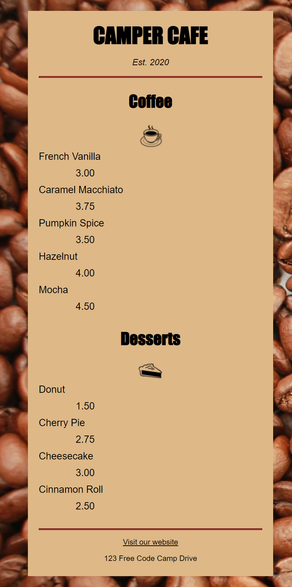

# FCC CAFE MENU

> A design of a cafe menu webpage using HTML5 & CSS.



Additional description of the project and its features.

## Built With

- HTML5 form elements
  - `h1`, `h2`, `section`,
  - `div`, `img`, `footer`, `article`.
- CSS properties
  - CSS Variables for reusable CSS values,
  - CSS Media Query for page responsiveness using `@media` rule,
  - CSS Positioning,
  - CSS Background for page aesthetic using `background-color`, `background-image`, ``.
- Linters
  - [Prettier](https://prettier.io/),
  - [Stylelint](https://stylelint.io/).
- GitHub Action

## Live Demo

[Live Demo Link](https://cafemenu-ismail.netlify.app/)

### Development (Running locally)

- Clone the project

```bash
git clone git@github.com:ismailadekunle/02-fcc-cafe-menu.git

```

- Install Dependencies

```bash
yarn install
```

To run StyleLint by itself, you may run the lint task:

```bash
yarn lint:check
```

Or to automatically fix issues found (where possible):

```bash
yarn lint
```

You can also check against Prettier:

```bash
yarn format:check
```

and to have it fix (to the best of its ability) any format issues, run:

```bash
yarn format
```

You can also check against Webhint:

```bash
yarn hint
```

## Style Guides

- [CSS Style Guide](http://udacity.github.io/frontend-nanodegree-styleguide/css.html)
- [HTML Style Guide](http://udacity.github.io/frontend-nanodegree-styleguide/index.html)
- [Git Style Guide](https://udacity.github.io/git-styleguide/)

## 👤 Author

- Github: [@author](https://github.com/author)
- Twitter: [@author](https://twitter.com/author)
- Linkedin: [@author](https://www.linkedin.com/in/author/)

* - Github: [@ismailadekunle](https://github.com/ismailadekunle)
* - Twitter: [@ismailadekunle](https://twitter.com/ismailadekunle)
* - Linkedin: [@ismailAdekunleJIMOH](https://www.linkedin.com/in/ismailAdekunleJIMOH/)
* - Freecodecamp: [@ismailadekunle](https://www.freecodecamp.org/ismailadekunle)

## 🤝 Contributing

Contributions, issues and feature requests are welcome!

Feel free to check the [issues page](../../issues).

## Show your support

Give a ⭐️ if you like this project!

## Acknowledgments

- Freecodecamp: [@ismailadekunle](https://www.freecodecamp.org/learn/2022/responsive-web-design/learn-basic-css-by-building-a-cafe-menu/step-1)

## 📝 License

[MIT licensed](./LICENSE).
